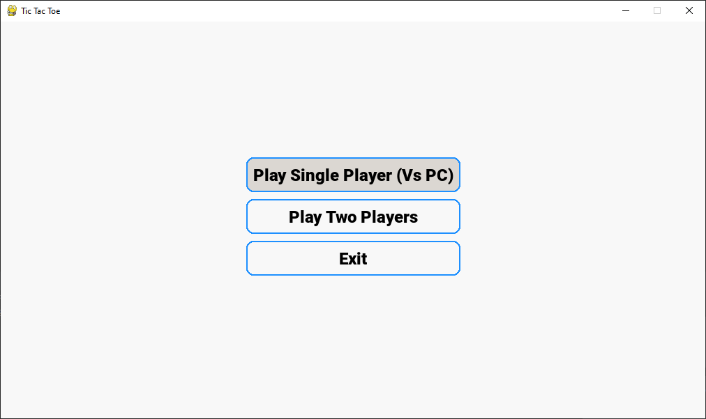
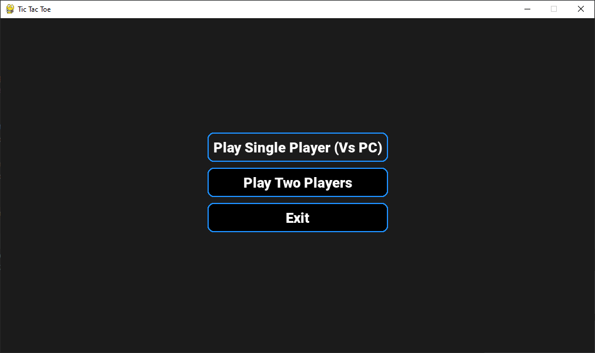
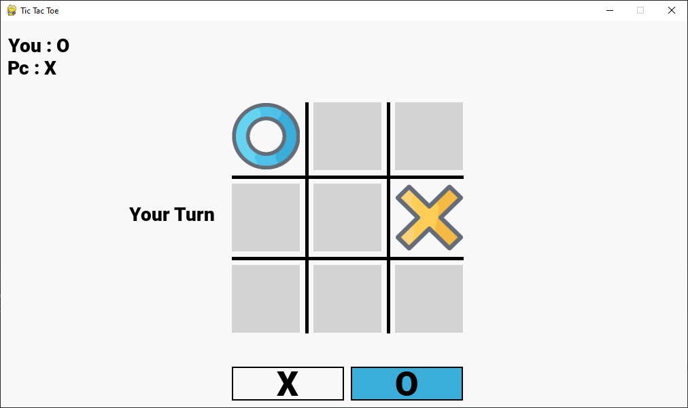
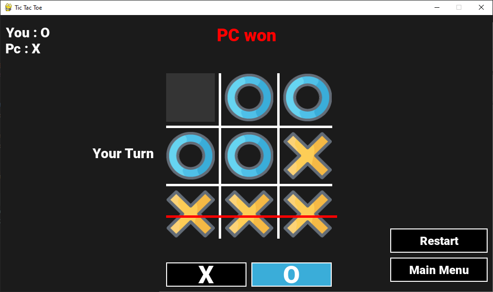

# Tic Tac Toe Game

## Overview

Tic Tac Toe Game is a simple Python implementation of the classic Tic Tac Toe game using the Pygame library. The game supports both single-player mode against a computer opponent and two-player mode for a local multiplayer experience.

## Features

- Single-player mode against a computer opponent (easy level).
- Two-players with your friend (Not Multiplier).
- Simple and intuitive gameplay.
- Light and Dark theme.

## Requirements

- Python 3.7.7
- Pygame 2.5.2

## Installation

1. Clone the repository
```
git clone https://github.com/urdurak/Tic-Tac-Toe-Game.git
```

2. Go to the root folder
```
cd Tic-Tac-Toe-Game
```
3. In the command prompt/ terminal run the following command
```
pip install -r requirements.txt
```


## How To Play 

1. Run the following command to get started
```
python main.py
```
2.Choose the game mode from the main menu:

- "Play Single Player (Vs PC)" for single-player mode.
- "Play Two Players" for two-player mode.

3.Follow the on-screen instructions to make your moves.

## Screenshots

- Main Menu
  
 

- In game

 

## Contact

- Instagram : https://www.instagram.com/urdurak/
- E-mail : ugrdrak@gmail.com
- E-mail 2: ugurdurak52@gmail.com
